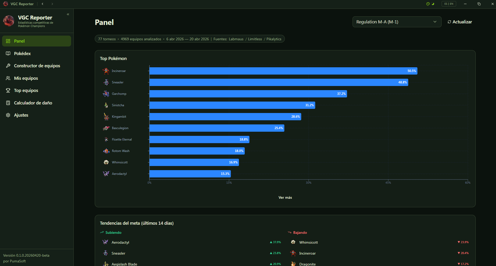
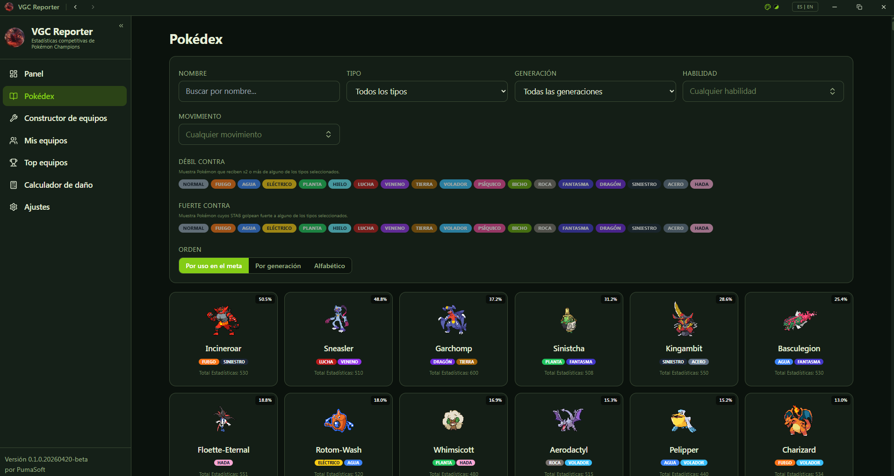
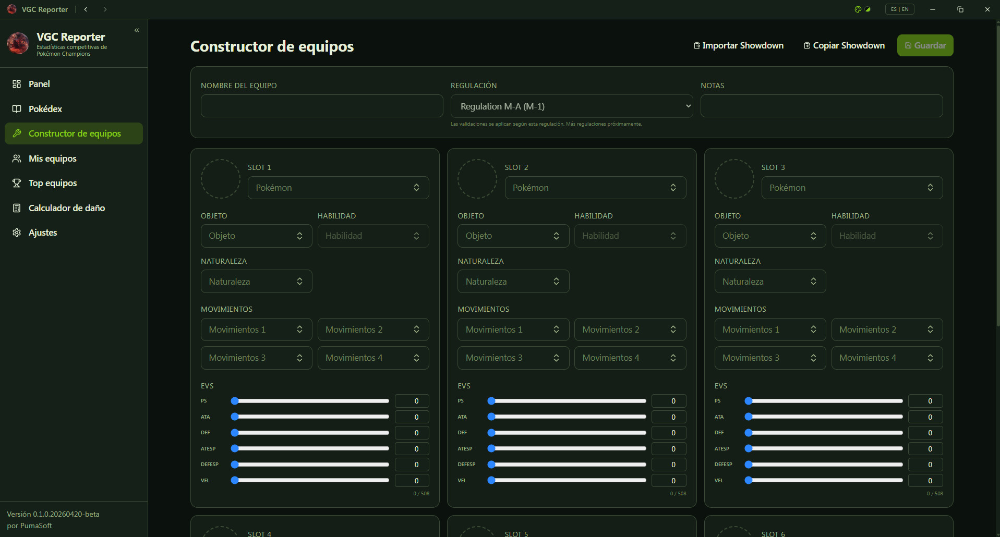
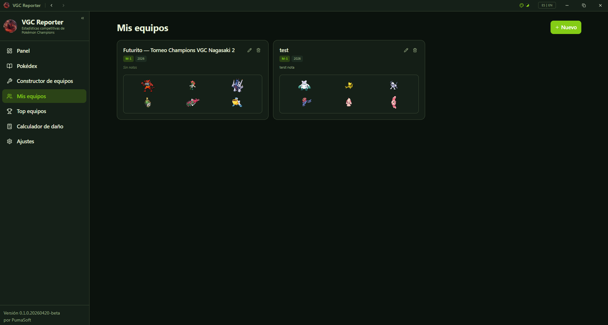
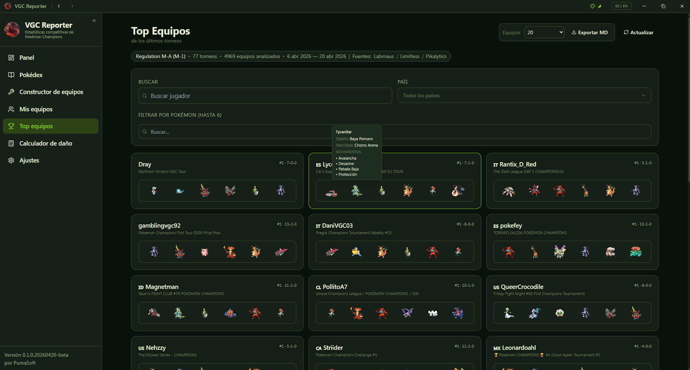
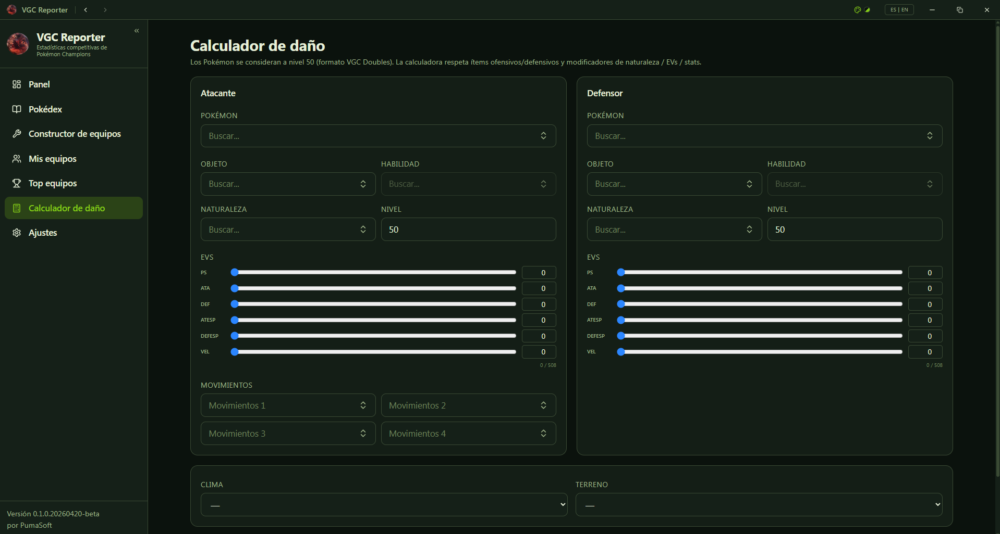
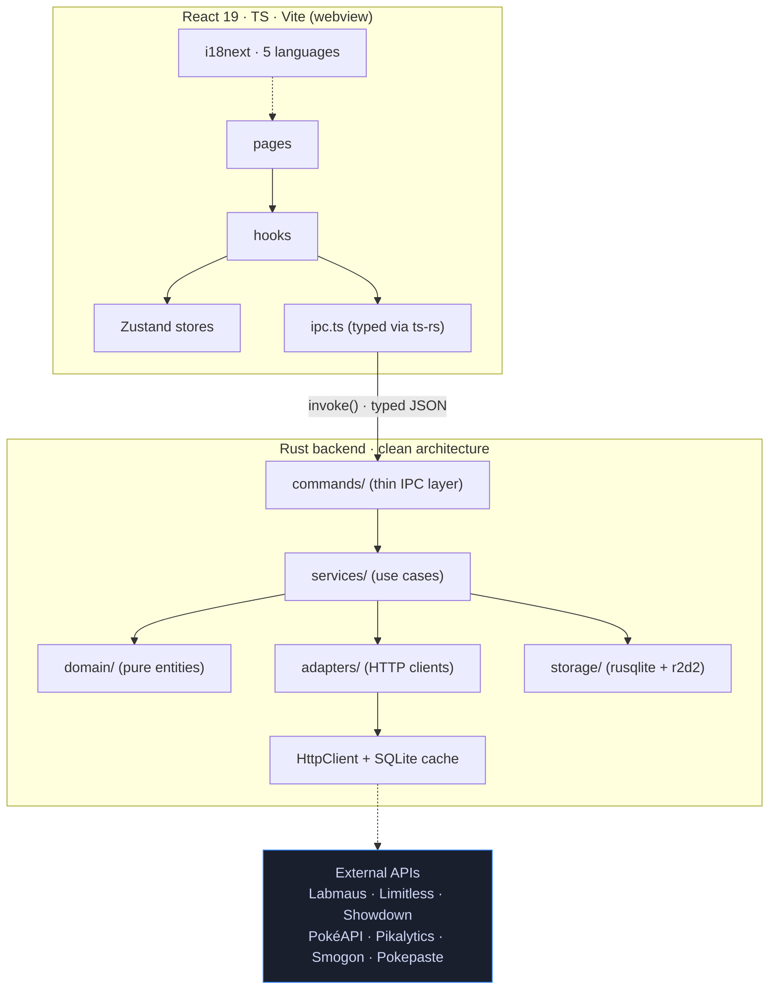

<div align="center">


# VGC Reporter

**Pokémon Champions competitive stats & team builder, as a native app for desktop and Android.**  

**Public beta — first release! Built with pure, hardcore vibe-code. Expect rough edges; please report any issue you hit so we can iterate fast.**

[![Version][version-badge]][version-link]
[![Beta][beta-badge]](#download)
[![Tauri][tauri-badge]][tauri-link]
[![Rust][rust-badge]][rust-link]
[![React][react-badge]][react-link]
[![License][license-badge]](LICENSE)
[![PumaSoft][pumasoft-badge]][pumasoft-link]

[Download](#download) · [Screenshots](#screenshots) · [Quick Start](#quick-start) · [Features](#features) · [Known Issues](#known-issues-beta) · [Data Sources](#data-sources) · [Architecture](#architecture) · [Development](#development)

</div>

---

## Problem

Pokémon Champions launched on 8-Apr-2026 and instantly became the official VGC 2026 / Worlds platform. Usage data is scattered across Pikalytics, Pokemon-Zone, Porygon Labs, Champions Lab, Smogon chaos JSON and Limitless VGC standings. None of these sites share a unified API, and there is no offline-friendly way to browse the meta **and** build a team in the same place.

VGC Reporter is the tool I wanted while team-building for Regulation M-A: one window, real tournament data, drill-down by Pokémon, and everything cached locally.

## Solution

- **Real tournament data, not just ladder** — aggregates Limitless VGC standings into usage stats, with Smogon chaos as fallback when the format is too fresh. Recent Champions tournaments are listed with full decklists rendered inline.
- **Format switcher with favorite** — Regulation M-A (Champions doubles), Champions Singles, Regulation I, Gen 9 OU. Pin one as favorite so it opens first every time.
- **Offline-friendly by design** — SQLite-backed HTTP cache, all network I/O on the Rust side, zero CORS pain.

## Screenshots

<table>
  <tr>
    <td align="center">
      <br/>
      <sub><b>Dashboard</b> — meta snapshot, top usage, recent tournaments</sub>
    </td>
    <td align="center">
      <br/>
      <sub><b>Pokédex</b> — competitive sets, usage and type matchups</sub>
    </td>
  </tr>
  <tr>
    <td align="center">
      <br/>
      <sub><b>Team Builder</b> — regulation-aware pickers and EV sliders</sub>
    </td>
    <td align="center">
      <br/>
      <sub><b>My Teams</b> — local team library (rename / duplicate / delete)</sub>
    </td>
  </tr>
  <tr>
    <td align="center">
      <br/>
      <sub><b>Top Teams</b> — tournament-winning teams from Limitless, with filters and Markdown export</sub>
    </td>
    <td align="center">
      <br/>
      <sub><b>Damage Calc</b> — <code>@smogon/calc</code> Gen 9 with searchable inputs</sub>
    </td>
  </tr>
</table>

## Download

Pre-built installers for the **`v0.2.3.20260517-beta`** release:

| Platform | Installer | Notes |
|---|---|---|
| Windows 10/11 | `VGC.Reporter_0.2.3_x64_en-US.msi` | MSI installer (recommended) |
| Windows 10/11 | `VGC.Reporter_0.2.3_x64-setup.exe` | NSIS installer (portable-friendly) |
| macOS 12+ (Apple Silicon) | `VGC.Reporter_0.2.3_aarch64.dmg` | Unsigned — right-click → Open the first time |
| macOS 12+ (Intel) | `VGC.Reporter_0.2.3_x64.dmg` | Unsigned — right-click → Open the first time |
| Linux (Debian/Ubuntu) | `vgc-reporter_0.2.3_amd64.deb` | Requires `webkit2gtk-4.1` |
| Linux (any distro) | `vgc-reporter_0.2.3_amd64.AppImage` | `chmod +x` then run |
| Android 7+ (arm64) | `VGC.Reporter_v0.2.3.20260517-beta_android.apk` | Sideload: enable "Unknown sources" first |

**[→ Download from the latest GitHub Release](https://github.com/felipesuarez-dev/vgc-reporter/releases/latest)**

First launch downloads ~10 MB of Pokédex / moves / items / abilities and caches them locally; subsequent launches work offline until caches expire.

## Quick Start

```bash
bun install
bun run tauri:dev
```

First launch downloads and caches Pokédex, moves, items, abilities and usage stats. Subsequent launches are offline-capable until caches expire.

## Features

| Area | What it does |
|---|---|
| **Dashboard** | Format selector with favorite star, top Pokémon with three switchable visualizations (bar chart, grid, **meta-share treemap**), Top Items / Moves / Abilities / Tera lists with click-through drill-down, recent Champions tournaments with **inline decklists** and search-by-player or by-Pokémon (backend-indexed), Twitter cards for `@VGCdata` / `@VGChampStats` |
| **Pokédex** | Sortable by generation / alphabetical / meta usage; click any Pokémon for a large modal with curated competitive sets (Doubles & Singles tabs), live meta usage and **type matchups** (weak/strong against). Includes the **two Basculegion gendered forms** (distinct stats) and **AZ's Floette-Eternal** sprite as the canonical Floette |
| **Team Builder** | 6 slots with searchable comboboxes for Pokémon / item / ability / nature / Tera / moves, EV sliders + **per-stat IV sliders**, level / gender / shiny / nickname fields. Pickers are filtered live by the active regulation (only legal species, items and moves shown), and Save runs full validation (completeness, EVs assigned, allow-list checks) surfacing issues in a modal |
| **My Teams** | Local SQLite persistence with rename / duplicate / delete. **Multi-team Showdown paste** import and export — pick which teams to bundle, copy to clipboard or download as `.txt` |
| **Top Teams** | Tournament-winning teams from Limitless rendered as mini-grids; same backend-indexed search-by-player/by-Pokémon as the Dashboard |
| **Search palette** | Global Ctrl+K palette with filter chips per kind (Pokémon / moves / items / abilities) — multi-select with a Clear button, also filters the recent-searches list |
| **Damage Calc** | `@smogon/calc` Gen 9 with searchable inputs for every field, real items & moves loaded from Showdown |
| **External sources** | Quick-launch panel for Pikalytics / Pokebase / Pokemon-Zone / Champions Lab / Munchstats (no scraping — just links) |
| **Localized data** | **5 languages** (ES / EN / PT / IT / FR) covering both the UI strings *and* ability / move / item names and descriptions from PokéAPI, with automatic fallback to English when an upstream string is missing |
| **Themes** | Light / Dark + custom Sneasler accent palette |
| **UX polish** | Window opens maximized, splash screen visible from the first frame, language and font size persisted locally, auto-update on desktop & Android |

## Known Issues (beta)

- **Top Teams "Show all"** can render 4000+ team cards in a single page. Performance is acceptable but expect 5–15s render on first display; the app shows progressive hints while loading.
- **macOS bundles are unsigned**. Gatekeeper will block the first launch — right-click the app → Open → Open Anyway. Code signing is on the post-beta roadmap.
- **Linux**: requires `webkit2gtk-4.1` (Ubuntu 22.04+ / Fedora 38+ ship it). Older distros need to install it manually.
- **Android APK is unsigned** (sideload only). Play Store distribution is on the roadmap.
- **Android auto-update**: the app will notify you when a new version is available and guide you through the install. You still need "Install from unknown sources" enabled.
- **First-run cache**: first launch needs internet. If a data source is down (Labmaus, Limitless), partial data is still rendered with a warning banner.
- **Pikalytics breakdown** depends on Pikalytics being up; falls back to Showdown chaos data when unavailable.

Found something else? [Open an issue](https://github.com/felipesuarez-dev/vgc-reporter/issues/new) — beta feedback is gold.

## Data Sources

| Source | Use | Notes |
|---|---|---|
| [Labmaus](https://labmaus.net) | Top teams, meta snapshot, trending, upcoming tournaments | **Primary** for Regulation M-A — requires Origin/Referer pinning, injected server-side so no CORS leaks |
| [Limitless VGC API](https://play.limitlesstcg.com/api/) | Tournaments, standings, decklists | Authoritative for Champions standings — decklists rendered inline |
| [Pokémon Showdown](https://play.pokemonshowdown.com/data/) | Pokédex, moves, items, abilities, sprites | Fetched on first run, cached 7 days |
| [Smogon chaos JSON](https://www.smogon.com/stats/) | Ladder usage fallback | Slug auto-discovery + rating ladder rewind |
| [pkmn/smogon data](https://data.pkmn.cc/) | Curated competitive sets | Doubles + Singles slugs per format |
| [Pikalytics](https://www.pikalytics.com/) | Per-species doubles breakdown (items, abilities, moves, Tera, teammates, EV spreads) | Surfaced inside the Pokémon detail modal |
| [Pokepaste](https://pokepast.es) | Importable team pastes | Pastes are immutable — cached 30 days |
| [PokéAPI CSV](https://github.com/PokeAPI/pokeapi/tree/master/data/v2/csv) | Localized names & flavor text | **5 languages** (EN / ES / PT / IT / FR) for abilities, moves, items — joined with Showdown data; missing per-locale rows fall back to English |
| [Showdown dex sprites](https://play.pokemonshowdown.com/sprites/dex/) | Sprite fallback | Variant-aware HD render for Mega/Regional forms |

**Not integrated** (no public API): Pokemon-Zone, Porygon Labs, Champions Lab, Pokebase, Munchstats. Exposed as one-click external links — no scraping.

## Architecture



Rule: dependencies always point inward. `domain/` knows nothing about I/O, Tauri or SQLite. All network calls flow through `adapters/http_client.rs` which writes to the SQLite cache so the frontend never needs to handle rate limits or CORS.

## Tech Stack

| Frontend | Backend | Build |
|---|---|---|
| React 19 | Rust 2021 | Tauri 2.4 |
| TypeScript | tokio | Vite |
| TailwindCSS | reqwest + rustls | `cargo` workspace |
| TanStack Query v5 | rusqlite + r2d2 | `bun run tauri:build` |
| Zustand | serde / thiserror | ImageMagick (icons) |
| React Router v7 | ts-rs | MSI installer (Windows) |
| i18next (5-language UI) | chrono / tracing | |
| Recharts | | |
| `@smogon/calc` | | |

## Development

```bash
# Dev mode (Vite HMR + Tauri window)
bun run tauri:dev

# Production bundle → src-tauri/target/release/bundle/msi/
bun run tauri:build

# Android — hot reload in emulator or USB device
bun run tauri android dev

# Android — build APK
bun run tauri android build --apk

# Rust tests + ts-rs bindings regeneration
cd src-tauri && cargo test

# Rust lint
cd src-tauri && cargo fmt && cargo clippy -- -D warnings

# Frontend type-check
bun run --cwd frontend build
```

> **Package manager**: this project uses **Bun** exclusively. Do not use `npm`/`npx`/`package-lock.json`. See `CLAUDE.md` § Package manager for the npm→Bun mapping.

## Project Structure

```
VGC-Reporter/
├── frontend/                 React 19 + TS + Vite
│   ├── src/
│   │   ├── pages/            one file per route
│   │   ├── components/       layout, pokemon, team, charts, tournament, dashboard, filters, info, ui
│   │   ├── stores/           Zustand (teamBuilder, dashboard, pokedex, filters, ui)
│   │   ├── lib/              ipc, queryKeys, types (ts-rs generated), formatDate, labels, typeChart
│   │   ├── hooks/            query + localization helpers
│   │   ├── locales/          es.json / en.json
│   │   └── i18n.ts
│   └── public/logo.png
├── src-tauri/                Rust backend (clean architecture)
│   ├── src/
│   │   ├── domain/           pure entities
│   │   ├── services/         use cases
│   │   ├── adapters/         HTTP clients
│   │   ├── storage/          SQLite pool, migrations, repos
│   │   └── commands/         Tauri IPC handlers
│   ├── icons/                generated by ImageMagick
│   └── tauri.conf.json
├── assets/logo.png
├── CLAUDE.md                 project-wide guide
└── README.md
```

## Requirements

- Node.js 20+
- Rust 1.80+ (stable)
- **Desktop**: Windows 10/11, macOS 12+, or Linux with `webkit2gtk-4.1`
- **Android**: Android Studio + SDK API 24+, NDK r25c, JDK 17–24, `ANDROID_HOME` / `NDK_HOME` set; run `rustup target add aarch64-linux-android armv7-linux-androideabi i686-linux-android x86_64-linux-android` first
- First run needs internet access to populate the cache

## Author

<div align="center">


**[PumaSoft][pumasoft-link]**

</div>

## License

MIT © 2026 PumaSoft — see [LICENSE](LICENSE).

<!-- Reference-style definitions -->
[version-badge]: https://img.shields.io/badge/version-0.2.3.20260517--beta-2b86ff?style=flat-square&labelColor=0a0e14
[version-link]: #download
[beta-badge]: https://img.shields.io/badge/release-beta-ff6b6b?style=flat-square&labelColor=0a0e14
[tauri-badge]: https://img.shields.io/badge/Tauri-2.4-24c8db?style=flat-square&labelColor=0a0e14&logo=tauri
[tauri-link]: https://tauri.app
[rust-badge]: https://img.shields.io/badge/Rust-2021-dea584?style=flat-square&labelColor=0a0e14&logo=rust
[rust-link]: https://www.rust-lang.org
[react-badge]: https://img.shields.io/badge/React-19-61dafb?style=flat-square&labelColor=0a0e14&logo=react
[react-link]: https://react.dev
[license-badge]: https://img.shields.io/badge/license-MIT-a8d8a8?style=flat-square&labelColor=0a0e14
[pumasoft-badge]: https://img.shields.io/badge/by-PumaSoft-ff9f1c?style=flat-square&labelColor=0a0e14
[pumasoft-link]: https://github.com/felipesuarez-dev
